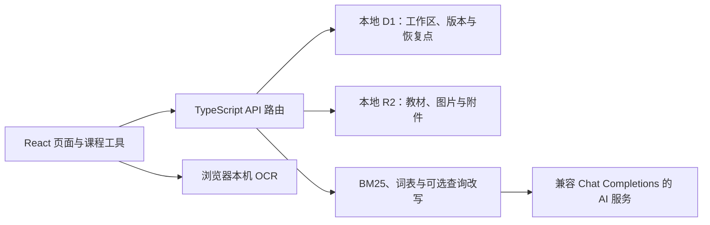

# 课伴 · 研学增强版

面向大学课程学习的本地知识库：围绕课程导览和教材，把资料阅读、带来源的 AI 问答、笔记、自测、错题与复习安排连接起来。当前版本 **0.3.0**，以提供的研学增强版 0.2 为更新基线。

代码仓库：[m012583/course-companion](https://github.com/m012583/course-companion)。2026-10-08 已核实为 Public，评审无需登录即可浏览源码与提交记录。

## 主要功能

- 课程、章节导览、逐章讲解、教材目录与知识点覆盖检查。
- PDF、DOCX、TXT、Markdown 资料；图片及扫描 PDF 本机 OCR、人工文字校正。
- 限定资料范围的流式 AI 问答、停止生成、原文引用与资料变更提示。
- 笔记、知识图谱、快速搜索、回收站及可继续编辑的笔记草稿。
- 两题自测、手工选择题／判断题、题库草稿确认、历史作答、错题再练、复习计划。
- 含附件迁移包、校验与导入预览、冲突保护、本机恢复点。

原创示例课、手工笔记、手工题库和复习管理不需要配置 AI。AI 生成内容需要自行配置兼容服务；没有密钥时不会伪造回答。

## 技术架构



前端使用 React 19、TypeScript、Tailwind CSS 4 和现有 UI 组件；`vinext` 与 Vite 承载文件路由及构建；Cloudflare 插件通过本地模拟提供 D1/R2。**本地使用不需要 Cloudflare 账号**。Markdown/公式使用 react-markdown、KaTeX；PDF 与 DOCX 分别由 PDF.js、Mammoth 提取；OCR 使用 Tesseract.js 及本地中英文语言包。具体版本以依赖清单和锁文件为准。

检索当前为 BM25、有限词表和可选 AI 查询改写，尚未引入 embedding 或向量数据库。教材校准检查文字对应关系，不等同于自动验证内容正确性。

## 安装与运行

环境：Node.js **22.13.0 或以上**及随附 npm；首次安装需要网络。当前已验证 Windows；提供 macOS/Linux 启动脚本，但本次没有对应实体系统验证。

```bash
git clone https://github.com/m012583/course-companion.git
cd course-companion
npm ci
npm run start:local
```

Windows 也可双击 `start.cmd`。首次运行或锁文件变化时，启动器安装锁定依赖、准备 OCR 资源并打开浏览器。默认地址 `http://localhost:3002/`；端口占用时尝试后续端口，以启动器实际显示为准。同目录重复启动会复用现有实例。

保持启动窗口开启，关闭窗口或按 Ctrl+C 停止服务。本地数据保存在项目的 `.wrangler/`，不要把删除该目录当成常规修复方法。默认仅监听本机。

AI 配置：复制 `.env.example` 为 `.env.local`，填写服务地址、实际可用模型与自己的密钥，然后重启。环境变量逐项说明见 [环境与依赖](docs/ENVIRONMENT.md)。不必配置 AI 即可先体验原创示例课和手工题库。

## 验证与代码规范

```bash
npm test
npm run typecheck
npm run lint
npm run build
node tools/evaluate-expanded.mjs
```

业务逻辑集中在 `lib/`，页面交互在 `components/` 与 `app/page.tsx`，外部调用和数据写入位于 `app/api/`。使用 TypeScript 类型检查、Oxlint 和 Oxfmt；事务、历史作答及引用版本等关键实现有注释与测试。通用 UI 封装保留合法的 ARIA role 组合，只对该目录关闭“优先使用原生标签”这一风格规则；其余可访问性与业务代码检查仍启用。

本次新增验证和限制见 [0.3 更新与验收](docs/UPDATE-0.3.md)。`docs/evaluation/` 保留有日期和范围说明的证据。检索自编样本结果不是独立盲测或学习效果证明；真实手机、第二台电脑和新一轮付费 AI 评测尚未完成。

依赖审计仍有未解决事项，详见 [审计结果](docs/evaluation/dependency-audit.json)。兼容修复预检存在依赖冲突，本次未强制降级，也不声称可以直接安全部署公网。

## 目录

```text
app/          页面、API 路由与全局样式
components/   课程导览、教材校准、题库、笔记和备份界面
lib/          数据结构、检索、校准、题目、备份、恢复点及 OCR
db/           数据表定义与迁移
migrations/   本地存储迁移脚本
tests/        领域规则、接口、历史与数据保护测试
tools/        启动、OCR 准备、评测、迁移验证和源码打包
docs/         更新、环境、历史说明及评测记录
public/       静态资源；OCR 运行资源在安装后生成
```

## 数据迁移与版本回退

在旧增强版导出“含附件迁移包”，在新版“设置与备份”选择文件、查看预览后确认恢复。新版保留增强版第 2 版迁移包格式，扩展题库、历史作答与笔记草稿。恢复前自动留档；下载的迁移包与本机恢复点作用不同，完整说明见 [更新说明](docs/UPDATE-0.3.md)。

回退使用原增强版目录及原数据；先另存新版的完整迁移包。不要将 `.env.local`、`.wrangler/` 或个人迁移包上传到仓库。

## Git 历史

保留原仓库全部现有提交，并以真实的增强版导入基线和后续更新接续，不重写旧提交、不压缩历史、不回填虚构日期。提供的源码包没有附带更早的开发历史，因此不能据此重建未知记录。详细来源与检查方法见 [Git 历史说明](docs/GIT_HISTORY.md)。

评审可查看 [完整提交记录](https://github.com/m012583/course-companion/commits/main)。

## 团队信息

用户确认以下信息暂未确定，保留为待补充，提交比赛前需填写真实信息。

| 项目 | 信息 |
| --- | --- |
| 团队名称 | 待补充 |
| 成员姓名 | 待补充 |
| 成员分工 | 待补充 |
| 仓库账号 | `m012583`，不作为成员真实姓名 |

## 参考与许可

已有设计与开源参考记录见 [课程导览参考](docs/course-guide-references.md)、[设计参考](docs/design-references.md) 和随仓库保留的许可证。项目代码公开供评审访问；上传教材与笔记的使用权由其来源决定，不随示例代码自动授予。
